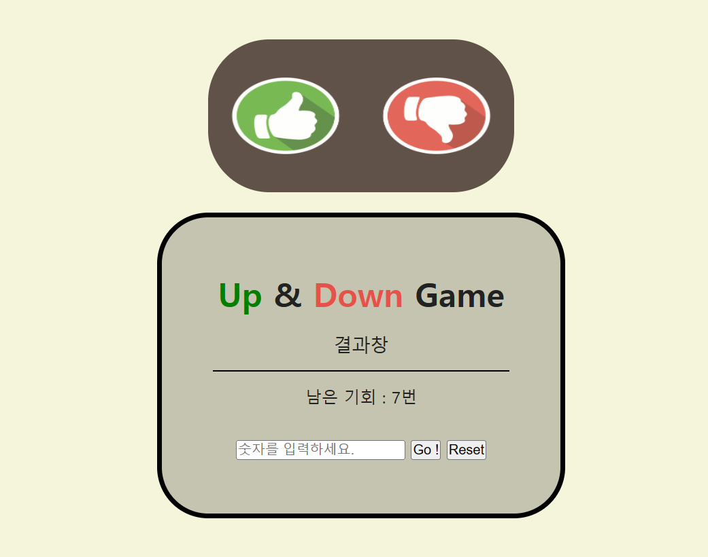

# Up-Down-Game 👍👎

JavaScript를 이용한 간단한 Up-Down 게임
 
자동으로 선택된 랜덤 숫자 맞추기 !

## [Preview] 

 

## [기능 구현] 
1️) 숫자를 인풋창에 입력
2️) 사용자 입력 숫자 > 랜덤 숫자 => Up 출력
3) 사용자 입력 숫자 < 랜덤 숫자 => Down 출력
4) 총 기회는 7번으로, 그 안에 맞추면 성공!
5️) Reset 버튼

